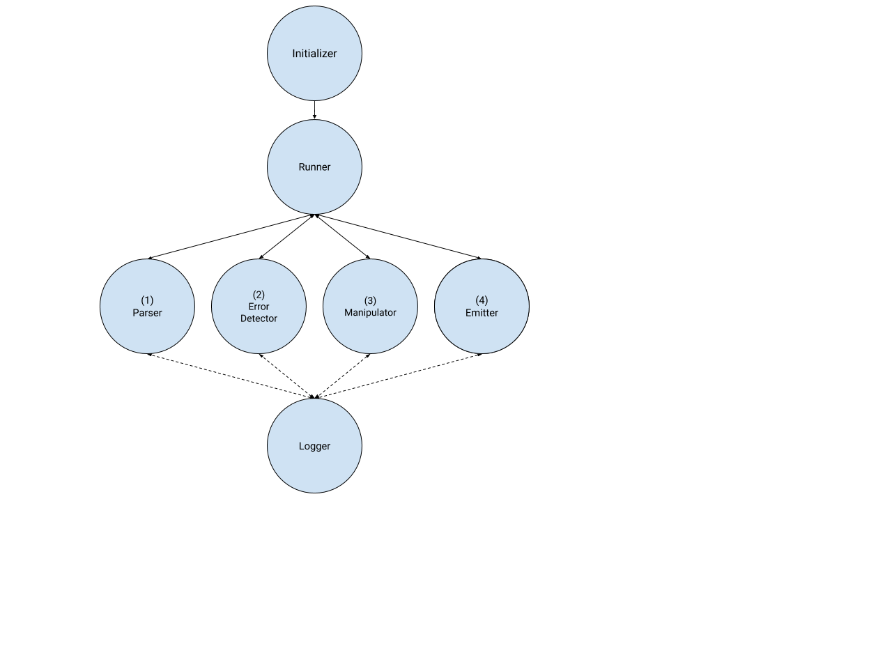

# TypeScript Flag Upgrade

A CLI tool that automatically upgrades TypeScript codebases to conform to strict compiler flags using the `ts-morph` library and TypeScript compiler API.


Table of Contents
=================

  * [Getting Started](#getting-started)
      * [Usage](#usage)
      * [Prerequisite](#prerequisite)
      * [User Flow](#user-flow)
  * [Developer and Maintenance Guide](#developer-and-maintenance-guide)
      * [Supported Flags and Fixes](#supported-flags-and-fixes)
      * [Unsupported Cases](#unsupported-cases)
      * [Architecture](#architecture)
      * [Testing](#testing)
      * [Linting](#linting)
  * [Read More](#read-more)
  * [Source Code Headers](#source-code-headers)  

## Getting Started

### Usage

To upgrade a TypeScript project, first clone this repository and navigate to its directory:

```
git clone https://github.com/googleinterns/typescript-flag-upgrade.git
cd typescript-flag-upgrade
```

Then run the following command with the corresponding arguments:

```
npm run dev -- -p <relative-path-to-tsconfig> [-i <relative-path-to-input-dir>]
```

More specifically, the mandatory `-p` argument specifies the relative path to the `tsconfig.json` file of the TypeScript project to be upgraded. The tool will automatically retrieve all TypeScript files within the project based on the `tsconfig.json`. In the case you want to specify a separate or subdirectory to upgrade, you can specify the optional `-i` flag to override the input directory.

After running the command, the tool mutatively changes the input TypeScript files to fix for any errors that it found. Before each change, the tool inserts a comment of the form: `// typescript-flag-upgrade automated fix: --[compilerFlag]`.

### Prerequisite
Before running this tool, ensure that your TypeScript project is already compiling with no errors. This means that you should set any compiler flags that are causing errors to `false`. If the input TypeScript project has compiler errors, then this tool will error out and stop execution. After running the tool, reactivate the compiler flags that were originally causing the errors, and the number of errors should have decreased.

For help, run:

```
npm run dev -- --help
```

### User Flow

This tool was designed to be used iteratively as a way to semi-automatically fix and speed up the upgrading process for engineers:

1. The engineer ensures that the TypeScript project is fully compiling with the flags set to false.
2. The engineer runs the tool on the TypeScript project. During the run, the tool fixes as many errors as possible automatically. For errors that the tool is unable to fix automatically (see Supported Flags and Fixes), the tool logs a message to the engineer detailing the location of the error, as well as the relative priority of the error (based on how many other errors are associated with this location). 
3. The engineer reads through the log to determine the highest priority errors and fixes to make.
4. After fixing the highest priority errors, the engineer can re-run this tool, which will then propogate this fix other errors associated with the high-priority fixes that the engineer just made. 
5. This process can be repeated as a way to iteratively upgrade larger TypeScript codebases.

## Developer and Maintenance Guide

This tool was designed, implemented, and tested within a period of 3 months, and there are many areas in which it can be improved.

### Supported Flags and Fixes

Currently, this tool supports fixes for the following compiler flags. For detailed documentation of the exact fixes the tool makes for each flag, see the Project Design Doc.

##### --noImplicitReturns

This flag triggers an error whenever codepath is missing a return value. To fix this, the tool adds a missing `return undefined` statement to end of every codepath:

```
function foo(bar: string) {
   if (bar === "") {
       return bar;
   }
   // typescript-flag-upgrade automated fix: --noImplicitReturns
   return undefined;
}
```

##### --strictNullChecks

This flag triggers an error whenever an object is possibly `null` or `undefined`. To fix this, the tool adds a definite assignment assertion:

```
function print(v?: number) {
   // typescript-flag-upgrade automated fix: --strictNullChecks
   console.log(v!.toString());
}
```

This flag also triggers an error whenever `null` or `undefined` is assigned to a variable not declared with those types. To fix this, the tool expands the variable's declaration type:

```
// typescript-flag-upgrade automated fix: --strictNullChecks
let y: number | null;
y = null;
```

##### --strictPropertyInitialization

This flag triggers an error whenever a property is not initialized to a value. To fix this, this tool adds a definite assignment assertion:

```
class C {
   // typescript-flag-upgrade automated fix: --strictPropertyInitialization
   foo!: number;
   constructor() { }
}
```

##### --noImplicitAny

This flag triggers an error whenever a variable has an implicity `any` type. To fix this, the tool attempts to infer the variable's type based on values it is assigned to through assignment statements and function calls.

```
foo("bar");
// typescript-flag-upgrade automated fix: --noImplicitAny
function foo(baz: string | number) {
    baz = 0;
}
```

This tool does not support array and object types. In the case that the tool is unable to determine the type of a variable, it determines the number of other variables whose type is dependent on original variable, logging a message of the form:

```
Unable to automatically calculate type of 'foo'. This declaration also affects 5 other declarations.
```

The engineer can then parse through these logs to determine which variables are most effective to fix.

In addition, because it was found that Jasmine testing files often containing multiple instances of variable run-time types not matching their compile-time types (caused by functions in the `TestBed` class, which have a compile-time return type of `any`). Also, in multiple test files, there were cases of accessing private methods and fields, which would only be allowed at compile-time for variables of type `any`. Because there are no easy solutions for these cases, the `NoImplicitAnyManipulator` skips fixes for all test files (any file ending in `_test.ts` or `.spec.ts`) in order to prevent making unwanted changes.

### Unsupported Cases

This tool does not support more complex non-scalar types, such as (untyped or empty) arrays and objects. This is mainly due to the complexities of each of these data structures, which require hard-coding to take care of all cases. It was decided to leave these cases up to the engineer to fix with output logs as opposed to attempting to fix for all cases and potentially causing a runtime error.

In addition, this tool prevents `any` pollution. In any cases where the tool deems that a variable is actually type `any`, then it ops to skip the case and log a message instead. Doing so prevents it unintentially spreading the use of `any` throughout the codebase.

### Architecture

The architecture of this tool was designed to be easily extendible:


Execution was split into the following extendible base classes:

- **`Runner`:** Parses args, inits project, and handles overall implementation logic.
- **`Parser`:** Parses input project's source files into abstract syntax trees and checks for compile errors.
- **`ErrorDetector`:** Locates specific syntax nodes responsible for each error, as well as the associated compiler flag and `Manipulator`.
- **`Manipulator`:** Modifies abstract syntax tree to fix for errors related to a specific flag.
- **`Emitter`:** Emits the modified source files back to the original TypeScript project.
- **`Logger`:** Logs messages to the user.

### Testing

To run tests:

```
npm run test
```

There are two main types of test:

##### Unit Tests

Standard unit tests to test specific functionalities in the manipulators. Located in `**_test.ts` files in the `test/` directory.

##### Functional Tests

Functional tests that automatically run the CLI on a set of test input files with specific anti-patterns (located in the `test/test_files/` directory) and compares the outputted files with a set of golden files (located in the `test/test_files/golden/` directory) with an AST matcher (located in `testing/source_file_matcher.ts`). Tests located in `**_test.ts` files in the `test/` directory.

### Linting

This project is linted by [gts](https://github.com/google/gts). To run linter:

```
npm run check
```

## Read More

- [Project Resources (Design Doc, Deep Dive, Proposal, Final Presentation)](https://drive.google.com/drive/folders/1tIrUwkRZj-fPlMzmH4NKt9FWMtQyZ3PC?usp=sharing) (Accessible by Google org only)
- [`ts-morph` Repository](https://github.com/dsherret/ts-morph)
- [TypeScript Compiler API Documetation](https://github.com/Microsoft/TypeScript/wiki/Using-the-Compiler-API)
- [TypeScript Compiler Flags Documentation](https://www.typescriptlang.org/docs/handbook/compiler-options.html)

## Source Code Headers

Every file containing source code must include copyright and license
information. This includes any JS/CSS files that you might be serving out to
browsers. (This is to help well-intentioned people avoid accidental copying that
doesn't comply with the license.)

Apache header:

    Copyright 2020 Google LLC

    Licensed under the Apache License, Version 2.0 (the "License");
    you may not use this file except in compliance with the License.
    You may obtain a copy of the License at

        https://www.apache.org/licenses/LICENSE-2.0

    Unless required by applicable law or agreed to in writing, software
    distributed under the License is distributed on an "AS IS" BASIS,
    WITHOUT WARRANTIES OR CONDITIONS OF ANY KIND, either express or implied.
    See the License for the specific language governing permissions and
    limitations under the License.
